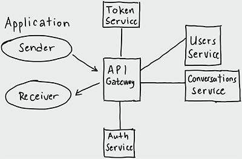

# Chat POC Backend

This is the backend part of [Chat POC](https://github.com/alfedalinan/chat-poc-client) client side application. This is split into layers, the API and the microservices.

## Flow Diagram

The API Gateway is the center of all request and response of the application. Every request will be undergoing auth process before forwarded to main microservces (users and conversations currently).

## Technologies

1. API Gateway
    - Node.js
    - GraphQL (Apollo Server)
    - Socket.io

2. User & Conversations Microservices
    - NestJS Framework
    - TypeScript
    - Sequelize
    - MySQL
    - Express

## Setup

1. Install pm2 via npm globally: `npm install -g pm2`
2. Clone the repository and its submodules: `git clone --recurse-submodules -j8 https://github.com/alfedalinan/chat-poc-backend.git`
3. Go to cloned repository: `cd chat-poc-backend`
4. Make sure to checkout each submodule from `master` branch: `git submodule foreach "git checkout master"`
5. Install dependencies for each submodule: `git submodule foreach "npm install"`
6. Copy each .env.template file as .env within the same directory of each submodule `git submodule foreach "cp .env.template .env.<environment>"`
7. Start the application using the command: `pm2 start ecosystem.config.js`